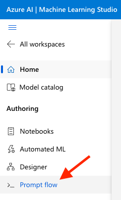
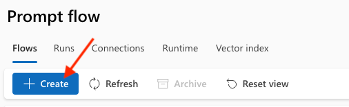

# Guide for chatbot i Azure

## Oppsett av chatbot i Azure
- Følg dataseksjonens guide for å sette opp Open AI ressurser i Azure (https://dataseksjonen.intern.nav.no/kompetanse/guider/openai_azure.html)
- Åpne ressursen i Azure AI Machine Learning Studio (ml.azure.com/)
- Klikk på "Prompt flow" --> "Create" og vi har brukt Multi-Round Q&A on Your Data

## Last opp data til chatbot

## Testing
- Innebygget testfunksjon i Azure AI Machine Learning Studio
- Klikk på "Evaluate" inne i prompt flow som ønskes testet 
- Legg inn testdata med spørsmål og en fasit på hva svaret skal være
- Vi brukte Ada-similarity som metric for å evaluere hvor godt chatboten svarte
  - Ada-similarity er en måte å sammenligne to tekster på, og gir en score mellom 0 og 1, hvor 1 er perfekt match

## Deploy av chatbot